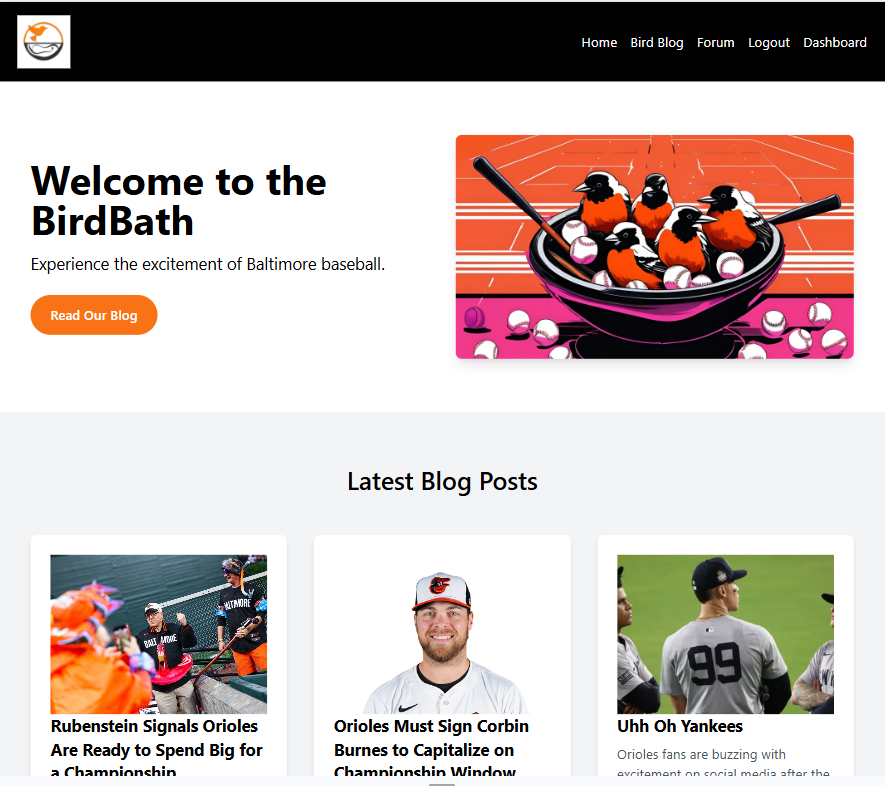
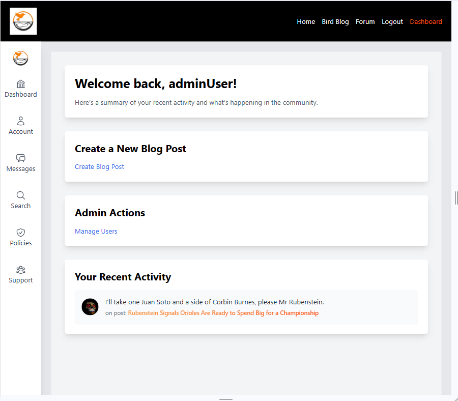
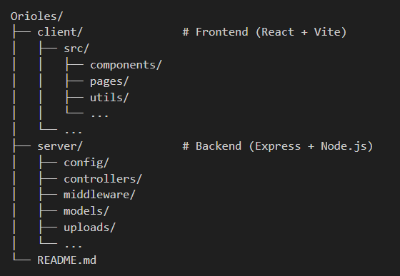

# Orioles Fan Blog Project ⚾🧢⚾
Welcome to the Orioles Fan Blog! This application provides an interactive platform for Baltimore Orioles fans to share opinions, discuss game highlights, and connect with other fans.



## Table of Contents 📖📖📖
- [Project Overview](#project-overview)
- [Features](#features)
- [Technologies Used](#technologies-used)
- [Setup and Installation](#setup-and-installation)
- [Environment Variables](#environment-variables)
- [Usage](#usage)
- [Project Structure](#project-structure)
- [Contributing](#contributing)
- [License](#license)

## Project Overview 😊😊😊
The Orioles Fan Blog is a full-stack web application that provides a blog-based platform for fans of the Baltimore Orioles baseball team. Users can read, comment on, and interact with blog posts about the Orioles, while registered members can create accounts to join the community. Admins can manage posts, and all posts include features like comments and images.

##  Features 🤯💥🧨

**User Authentication:** Sign up and log in to access the full range of features.

**Blog Creation:** Admin and Writers can create and edit blog posts, adding images and text content.

**Profile Management:** Users can update personal profiles, including profile pictures stored on Amazon S3.

**Image Uploads:** Blog posts and user profiles support image uploads, managed through Amazon S3.

**Commenting and Interaction:** Users can comment on blog posts and interact with content.

**Search and Filtering:** Search for posts by keywords, authors, or date ranges.



## Technologies Used ⚙️⚡⚙️

### Frontend 🐥
**React:** For building the user interface.

**React Router:** For routing between different pages.

**Tailwind CSS:** For styling and responsive design.

**JWT:** For token-based authentication.

### Backend 🎒
**Node.js:** JavaScript runtime environment.

**Express:** Web framework for the server.

**Sequelize:** ORM for managing PostgreSQL.

**AWS S3:** Cloud storage for images.

**PostgreSQL:** Database for storing application data.

## Setup and Installation 🛝🥳🎴

1. Clone the repository
 ```bash
    git clone https://github.com/S-Bolt/Orioles.git
    cd Orioles
```

2. Install dependencies
```bash
    npm install
    cd client && npm install
    cd ../server && npm install
```

3. Setup PostgreSQL: Ensure PostgreSQL is installed and running. Create a new database for the application.

4. AWS S3 Bucket: Configure an S3 bucket for storing images.

## Environment Variables 🔐🤐🪪

Create .env files in the root, client, and server directories as needed. Here’s a template for the server .env:
```plaintext
    PG_USER="your_db_user"
    PG_PASSWORD="your_db_password"
    PG_HOST="your_db_host"
    PG_DATABASE="your_db_name"
    PG_PORT="5432"
    JWT_SECRET="your_jwt_secret"

    AWS_ACCESS_KEY_ID="your_aws_access_key"
    AWS_SECRET_ACCESS_KEY="your_aws_secret_key"
    AWS_REGION="your_aws_region"
    S3_BUCKET_NAME="your_bucket_name"
```
Client.env:
```plaintext
    VITE_API_BASE_URL="your_api_base_url"
```
## Usage 🥳💃🎈
Navigate to main directory then start development server
```bash
    cd Orioles
    npm run dev
```
Once done open the app by visting http://localhost:5173/ 

## Project Structure🫀🧠🤯



## Contributing 💁🤗🤗

1. Fork the repository.
2. Clone the forked repository.
3. Create a new branch.
4. Make your changes and test thoroughly.
5. Submit a pull request.

## License 🪪👍⚡
This project is licensed under the MIT License - see the [LICENSE](LICENSE) file for details.
